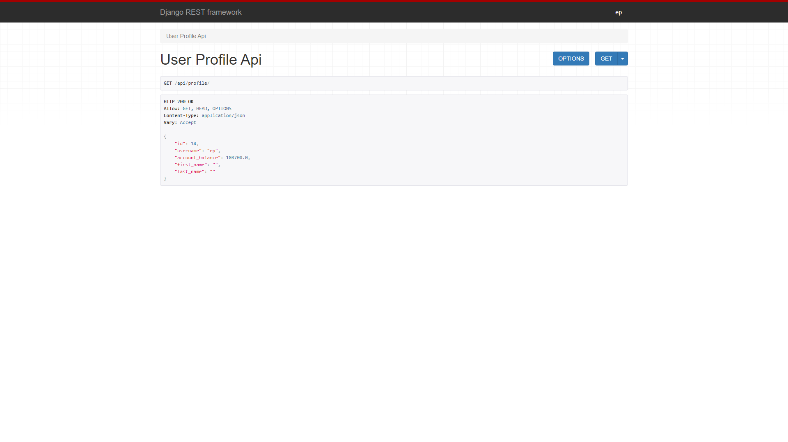
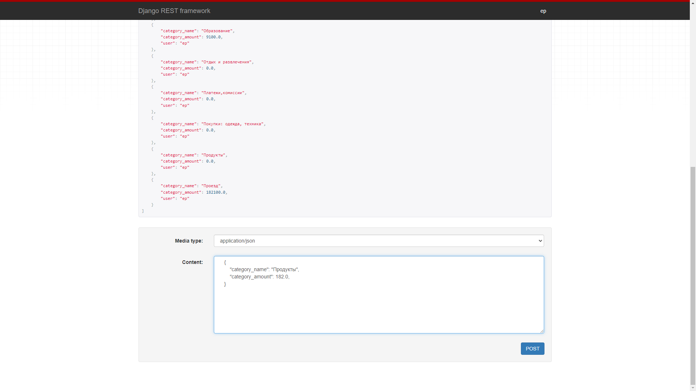
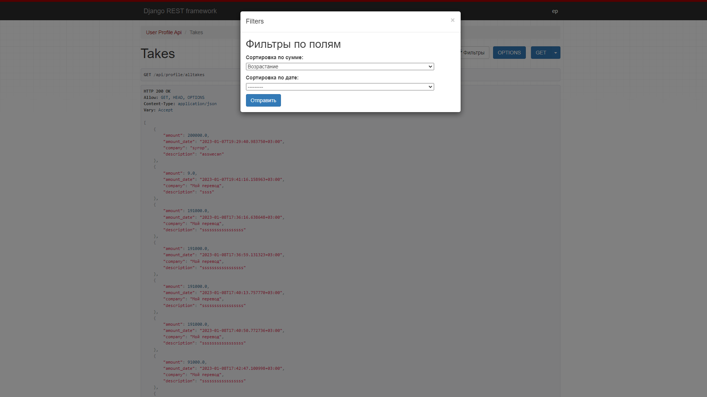

<h3>DRF project based on Test task</h3>
<h5>DRF web api balance manager.</h5>
<h6>Realize in project(Celery,TokenAuth,PandasStat)</h6>
<h6>Profile realization</h6>

<h6>Finance movement from balance to cost categories</h6>

<h6>All finance takes list(realize receive takes from profile and not from profile)</h6>

